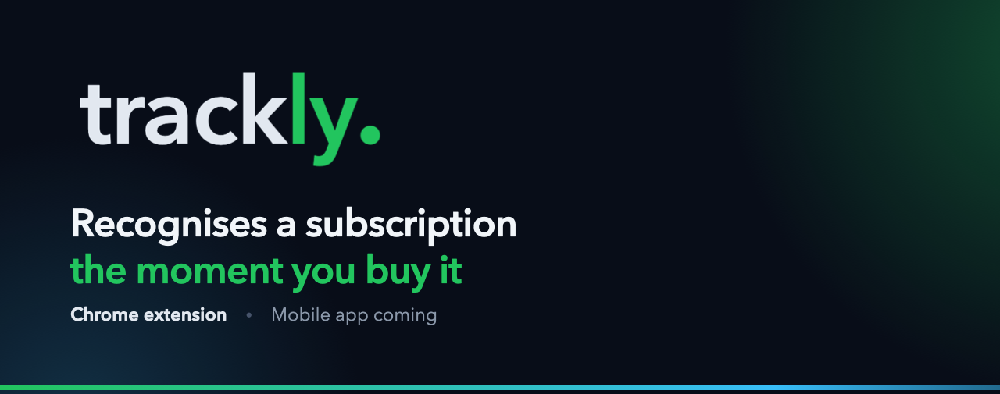

<p align="center">
  
</p>

<p align="center">
  <a href="https://chromewebstore.google.com/detail/trackly/mflggeobolhmojbgmniglaogbehggiap"></a>
  <a href="https://github.com/Michal0ss/Trackly/actions/workflows/tests.yml"></a>
</p>

<p align="center">
  <a href="https://chromewebstore.google.com/detail/trackly/mflggeobolhmojbgmniglaogbehggiap"><b>Chrome Web Store</b></a>
  &nbsp;·&nbsp;
  <a href="https://tracklyapp.pl">tracklyapp.pl</a>
  &nbsp;·&nbsp;
  <a href="https://tracklyapp.pl/privacy">Privacy policy</a>
</p>

# Trackly

Trackly is a Chrome extension for keeping track of subscriptions. Open the pricing page of a
service and it picks up the plan, the price and the billing cycle, then offers to save them.
The popup shows what you pay each month and each year, what renews in the next few days, and
the full list.

Recognition runs locally in the browser. The server only gets what you confirm and save.

The extension and the website are in Polish and English. The extension follows the browser's
language, the website has a PL / EN switch.

## What it does

- Recognises 35+ services: streaming, music and audiobooks, AI tools, cloud storage, VPNs,
  consoles and a few Polish shops. The full list is below.
- Shows a small prompt on the pricing page. *Add* passes it to the popup with the form already
  filled in, *Not now* keeps that service quiet for an hour.
- Also reacts to a click on the service's own buy or subscribe button, in case you skipped the
  prompt.
- Sums up the monthly cost, the yearly cost and the total for a whole year, separately for each
  currency (PLN, EUR, USD, GBP).
- Lists what renews in the next 7 days. The bell next to that list turns on reminders, a
  notification 1, 3 or 7 days before a renewal.
- Lets you edit or delete any entry. For most services there's also a link to the page where
  you change or cancel the plan.
- Lets you add older subscriptions by hand.
- Signs in with Google, so the list is the same on every computer.
- After you have used it for a while, asks whether you'd rate it in the store. *Not now*
  brings the question back once, a month later.

<details>
<summary><b>Supported services</b></summary>

<br>

| Group | Services |
| --- | --- |
| Video | Netflix, YouTube Premium, Disney+, Max, Prime Video, SkyShowtime, Canal+, Player, Polsat Box Go, Crunchyroll |
| Music and books | Spotify, Apple Music, Tidal, Deezer, Storytel, BookBeat, Legimi, Empik Go |
| Apps | ChatGPT, Claude, Canva, Notion, Adobe, Microsoft 365, GitHub Copilot, Duolingo |
| Storage and VPN | iCloud+, Dropbox, Google One, NordVPN, Surfshark, Proton |
| Games | PlayStation Plus, Xbox Game Pass, Nintendo Switch Online |
| Other | Apple One, Apple TV+, Apple Arcade, Amazon Prime, Allegro Smart, Empik Premium |

Adding a service means a host in `extension/manifest.json`, a hint in `SERVICE_HINTS` in both
recognisers (JavaScript and Python) and, if the service has one, an account page in
`extension/shared/service-links.js`. The tests fail when one of them is missing.

</details>

## How detection works

1. The content script is injected only on the hosts from the manifest and stays idle until you
   sign in. On big shops and app stores (Amazon, Allegro, Microsoft, PlayStation and so on) it
   also checks the path, so it looks at subscription pages and ignores the rest. Those rules are
   `DETECTION_PATHS` in `extension/content.js`.
2. A second after the page loads, and again whenever the URL changes, `extension/shared/detector.js`
   reads the page text and pulls out the service name, plan, price, currency and billing cycle.
   It's regular expressions and keyword lists, with no network calls. What it finds is kept in
   `chrome.storage.local` for an hour, so a plan seen on one page can be joined with a price
   seen on the next.
3. A page counts as a subscription offer only if it has a price. The prompt appears when the
   service isn't on your list yet and you haven't dismissed it in the last hour.
4. *Add*, or a click on the service's buy button, puts the candidate in a queue and makes the
   toolbar badge blink. Next time you open the popup the form is waiting, filled in. Nothing is
   sent to the server until you save that form.
5. The backend refuses a second active subscription for the same service with a 409, and the
   popup treats that as already saved.

`app/utils/subscription_detector.py` is the Python version of the same recogniser.
`tests/test_extension_consistency.py` runs both on the same cases through Node, so they can't
drift apart.

## Privacy

Page content, addresses of the pages you visit and your browsing history never leave the
browser. The backend stores your Google account's email and id, and the subscriptions you
saved: name, plan, price, currency, billing cycle and dates. No ads, no analytics, nothing is
sold. Reminders are checked by the extension itself and shown by the browser, with no outside
service involved. The full policy is at [tracklyapp.pl/privacy](https://tracklyapp.pl/privacy)
and in English at [tracklyapp.pl/en/privacy](https://tracklyapp.pl/en/privacy).

## Repository layout

| Path | What it is |
| --- | --- |
| `extension/` | Chrome extension, Manifest V3, plain JavaScript with no build step |
| `app/` | FastAPI backend: Google sign-in, JWT, subscriptions, summaries, health check |
| `api/index.py` | Entry point Vercel uses to serve the backend |
| `site/` | [tracklyapp.pl](https://tracklyapp.pl), landing page, phone app waitlist and privacy policy in Polish and English, Next.js |
| `mobile/` | Expo app: recurring payments, monthly overview and read-only subscriptions in PL / EN; see [mobile setup](mobile/README.md) |
| `tests/` | pytest suite |
| `.github/workflows/` | `tests.yml` for CI, `keepalive.yml` for the daily health check |
| `docs/` | Images for this README |

Inside `extension/`:

| File | Role |
| --- | --- |
| `content.js` | Runs on supported pages, decides when to prompt |
| `shared/detector.js` | The recogniser |
| `shared/detection-toast.js` | The prompt shown on the page |
| `shared/subscription-form.js` | The prefilled form in the popup |
| `shared/subscription-view.js` | Summary, renewals and the list in the popup |
| `shared/service-links.js` | Links to each service's account or billing page |
| `shared/reminders.js` | When a renewal reminder is due |
| `shared/i18n.js` | Translations and number formatting |
| `_locales/` | Polish and English texts |
| `UI/` | Popup markup, styles and logic |
| `background.js` | Toolbar badge, daily reminder check, sign-in for Edge |

## Running locally

### Backend

```bash
python3 -m venv .venv
.venv/bin/pip install -r requirements.txt
```

Copy `.env.example` to `.env` and fill in:

- `SECRET_KEY` signs the JWTs. Generate one with
  `python3 -c "import secrets; print(secrets.token_urlsafe(48))"`
- `GOOGLE_CLIENT_ID` is the OAuth client from the Google Cloud Console, the same one as
  `oauth2.client_id` in `extension/manifest.json`. Several ids can be given, separated by
  commas, which Edge needs because it signs in through a separate web client.
- `ALLOWED_ORIGINS` is `chrome-extension://<id>`, already filled in with the store id.
- `DATABASE_URL` is optional and defaults to a local SQLite file. Give it a Postgres
  connection string (Supabase or any other) to use that instead; `app/database/db.py` adjusts
  the pooling based on the scheme.

```bash
.venv/bin/python -m uvicorn app.main:app --reload
```

The API runs on `http://127.0.0.1:8000`, with every route under `/api` and the interactive
docs at `/docs`.

### Extension

Open `chrome://extensions`, turn on Developer mode, choose Load unpacked and point it at
`extension/`.

The `key` field in the manifest pins the extension id to `mflggeobolhmojbgmniglaogbehggiap`,
the same one the store assigned, so it's identical on every machine. That matters because the
Google OAuth client is registered against that id.

The extension talks to the deployed API by default. To point it at a backend on your own
machine, open the popup, then its devtools console, and run:

```js
chrome.storage.local.set({ api_base_url: "http://127.0.0.1:8000" })
```

Reload the extension afterwards. Remove the key to go back to production:

```js
chrome.storage.local.remove("api_base_url")
```

Chrome only waives CORS for hosts listed in `host_permissions`, which covers just the deployed
API. If local calls get blocked, add `"http://127.0.0.1:8000/*"` to that list while you work
and take it out before packaging for the store.

### Site

```bash
cd site
npm install
npm run dev
```

The waitlist form on the home page posts to the API through a server action. It uses the
deployed API unless `TRACKLY_API_URL` is set, so to try it against a local backend start the
site with `TRACKLY_API_URL=http://127.0.0.1:8000 npm run dev`.

CI builds it with Node 22.

### Mobile preview

The mobile app runs in Expo Go with SDK 57. M1 connects to a local test account for
recurring payments, monthly totals and read-only subscriptions. Sign-in, chat and
reminders will follow.
See [mobile/README.md](mobile/README.md) for iPhone setup and verification commands.

## Tests

```bash
.venv/bin/python -m pytest
```

83 tests cover the API routes, sign-in and tokens, the waitlist, the recogniser and the
reminder rules. A separate group keeps the extension and the backend in step: both recognisers
have to give the same results, every host in the manifest needs a service hint, every service
needs a manage link unless it deliberately has none, the path rules have to let subscription
pages through and block the rest, and both languages need the same set of texts, with every
text the extension uses present. The checks that run JavaScript call `node` and are skipped when it isn't
installed.

CI runs the suite and a production build of the site on every push to `main` and on every
pull request. The mobile job also checks types, lint, unit tests and JavaScript exports
for iOS, Android and the browser.

## API

Every route sits under `/api`. All of them except sign-in and the health check need an
`Authorization: Bearer <token>` header.

| Method | Path | What it does |
| --- | --- | --- |
| POST | `/api/users/google-login` | Swaps a Google access token for a Trackly JWT |
| GET | `/api/users/me` | The signed-in user |
| GET | `/api/subscriptions` | All subscriptions of the user |
| POST | `/api/subscriptions` | Adds one, 409 if the service is already active |
| GET | `/api/subscriptions/{id}` | One subscription |
| PUT | `/api/subscriptions/{id}` | Updates it |
| DELETE | `/api/subscriptions/{id}` | Deletes it |
| GET | `/api/subscriptions/summary/budget` | Totals per currency |
| GET | `/api/subscriptions/summary/expiring?days=7` | Renewals within `days`, 3 by default |
| GET | `/api/health` | 200 when the database answers, 503 when it doesn't |
| POST | `/api/waitlist` | Adds an email to the phone app waitlist, 422 without consent or with a malformed address |

## Deployment

| What | Where |
| --- | --- |
| Site | Vercel, linked to `main`, [tracklyapp.pl](https://tracklyapp.pl) |
| Backend | Vercel, linked to `main`, Python serverless through `api/index.py`, [trackly-api-git-main-michal-team00.vercel.app](https://trackly-api-git-main-michal-team00.vercel.app/api/health) |
| Database | Supabase Postgres through its connection pooler (`*.pooler.supabase.com:6543`) |

A merge to `main` redeploys both Vercel projects. A few things worth knowing:

- Vercel's zero-config Python only routes `/api/*` to `api/index.py`, which is why every route
  has that prefix.
- There's deliberately no `vercel.json` in the repo. Vercel reads it from the repository root
  for every project, whatever its Root Directory is set to, and an earlier one meant for the
  backend broke every route on the site.
- The direct Supabase host doesn't resolve from Vercel's network, so `DATABASE_URL` has to
  use the pooler.
- `SECRET_KEY`, `GOOGLE_CLIENT_ID`, `ALLOWED_ORIGINS` and `DATABASE_URL` live in the backend
  project's environment variables, where Production and Preview are separate scopes.
- Pull requests go in with a regular merge commit, not a squash. The Vercel account is on the
  Hobby plan, which only builds commits authored by the account owner, and a squash keeps the
  original author.

The free Supabase tier pauses a project after a week without database activity.
`.github/workflows/keepalive.yml` calls `/api/health` every morning, and since that endpoint
reads from the users table, it counts as activity. A red run means the API or the database is
down. GitHub switches scheduled workflows off after 60 days without any activity in the
repository; if that happens, turn it back on in the Actions tab.

### Releasing the extension

1. Bump `version` in `extension/manifest.json`.
2. Copy `extension/` somewhere outside the repo and delete the `key` field from the copied
   `manifest.json`, because the store doesn't accept a manifest that has one.
3. Zip the contents of that folder, not the folder itself, and upload the zip in the Chrome
   Web Store developer dashboard.

The same zip goes to Microsoft Edge Add-ons. Edge can't use Chrome's sign-in, so there the
extension signs in with `chrome.identity.launchWebAuthFlow` and a separate Google OAuth client
of the "Web application" type. Before the first Edge release:

1. Create that client and put its id in `GOOGLE_WEB_CLIENT_ID` in
   `extension/shared/api-client.js`.
2. Add the same id to the backend's `GOOGLE_CLIENT_ID`, after the Chrome one, separated by a
   comma.
3. Once Edge assigns the extension id, add `https://<edge-id>.chromiumapp.org/` to the
   client's authorised redirect URIs and set `EDGE_STORE_URL` in
   `extension/shared/store-links.js`, so the rating card points to the Edge store.

## Changelog

**1.2.0**

- English version of the extension, picked by the browser's language.
- Optional reminders 1, 3 or 7 days before a renewal. The notification permission is only
  requested when you turn them on.
- Detection understands US price formats such as "$9.99/mo", "a month", "/yr" and "annual".
- A one-time request to rate Trackly in the store.
- Sign-in that works in Microsoft Edge.

**1.1.0**

- The popup opens straight away with the last known data and refreshes in the background.
- A link to the service's account or billing page, for most services. Manage, edit and
  delete are now icon buttons.
- More services, 35+ in total.
- Fewer repeated prompts: services already on the list are skipped, a price is required, and
  on big sites like Amazon or Allegro only the subscription pages are checked.

**1.0**

- First release on the Chrome Web Store.

## Status

Trackly is built by two people and started as a university project. Next up is a phone app
that uses the same API, and its waitlist is open on [tracklyapp.pl](https://tracklyapp.pl/#aplikacja).

Found a bug or a service that isn't recognised? Open an issue or write to
[kontakt@tracklyapp.pl](mailto:kontakt@tracklyapp.pl).

Trackly isn't affiliated with any of the services whose subscriptions it helps track.
